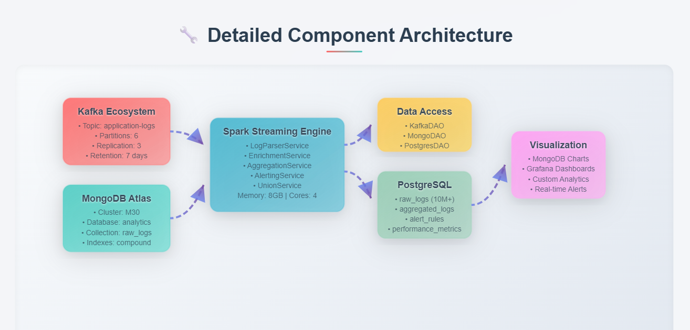
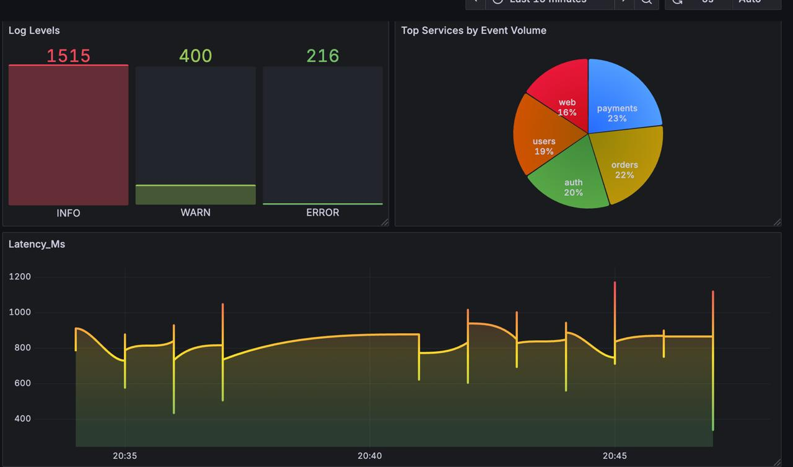
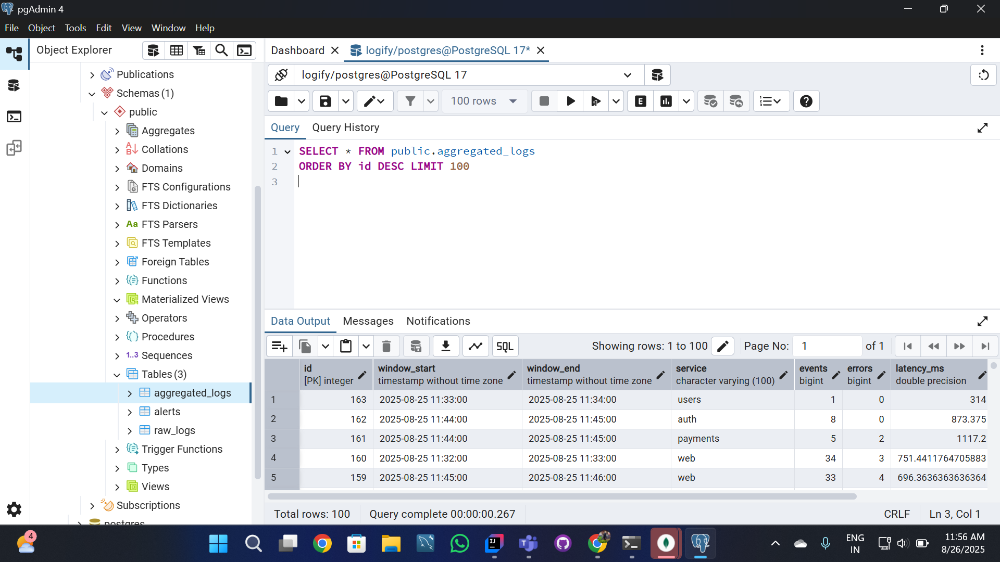
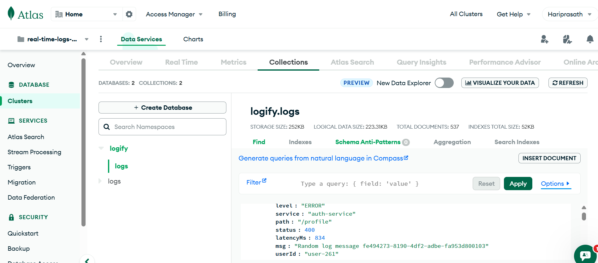
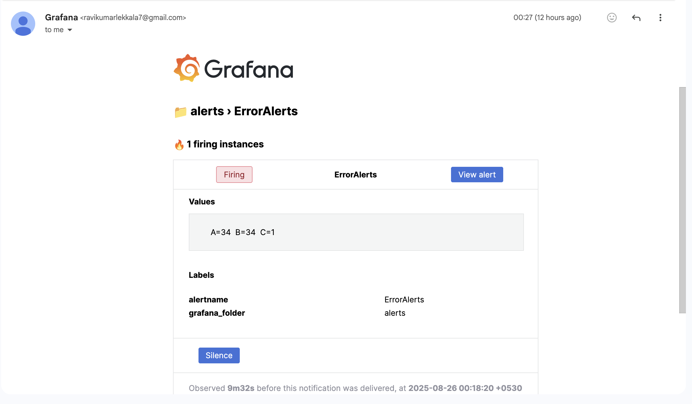

# 📊 Real-Time Log Analytics System

## 🚀 Overview

The **Real-Time Log Analytics System** is a scalable platform for **real-time log ingestion, processing, enrichment, and analytics**.
It integrates streaming data from **Kafka** and historical data from **MongoDB**, processes them via **Apache Spark Structured Streaming**, and stores enriched analytics in **PostgreSQL** for visualization and alerting.

### ✨ Key Features

* ⏱️ **Real-time monitoring** of application logs
* 🚨 **Error detection & alerting** (configurable rules)
* ⚡ **Performance insights**: request latency, throughput, error rates
* 📊 **Interactive dashboards** with **Grafana / Superset / MongoDB Atlas Charts**

---

## 🏗️ System Architecture

```text
Kafka (Streaming Logs) ----\
                            >---- Spark Structured Streaming ----> PostgreSQL (Analytics DB) ----> Grafana / Superset ----> Alerts
MongoDB (Historical Logs) --/                      
```



---

## 📂 Project Structure

```text
src/main/scala/com/loganalytics/
  ├── controller/
  │    └── LogStreamController.scala   # Entry point for streaming job
  ├── dao/
  │    ├── KafkaDAO.scala              # Kafka ingestion layer
  │    ├── MongoDAO.scala              # Mongo ingestion & metadata retrieval
  │    └── PostgresDAO.scala           # PostgreSQL read/write operations
  ├── service/
  │    ├── LogParserService.scala      # Parse raw JSON logs → structured schema
  │    ├── RawLogService.scala         # Normalize raw log schema
  │    ├── MongoLogService.scala       # MongoDB schema transformation
  │    ├── EnrichmentService.scala     # Service metadata enrichment
  │    └── UnionService.scala          # Merge live & historical datasets
  └── utils/
       └── SchemaUtils.scala           # Centralized schema definitions
```

---

## ⚙️ Tech Stack

| Technology                                                                                            | Role                         |
| ----------------------------------------------------------------------------------------------------- | ---------------------------- |
|        | Real-time log ingestion      |
|                  | Historical logs + metadata   |
|         | ETL, enrichment & analytics  |
|         | Analytics-ready data sink    |
|                        | Data pipeline implementation |
|                     | Containerized deployment     |
|  | Visualization                |

---

## 📥 Setup & Installation

### 1️⃣ Clone Repository

```bash
git clone https://github.com/your-username/Real-Time-Log-Analytics-System.git
cd Real-Time-Log-Analytics-System
```

### 2️⃣ Configure Connections

Update credentials in `src/main/resources/application.conf`.

### 3️⃣ Start Dependencies

* ▶️ Start **Kafka broker + Zookeeper**
* 🐘 Start **PostgreSQL** instance
* ☁️ Ensure **MongoDB Atlas** cluster is accessible

### 4️⃣ Build & Run

```bash
# Start Zookeeper
.\bin\windows\zookeeper-server-start.bat .\config\zookeeper.properties  

# Start Kafka broker
.\bin\windows\kafka-server-start.bat .\config\server.properties  

# Start Kafka consumer
.\bin\windows\kafka-console-consumer.bat --bootstrap-server localhost:9092 --topic logs --from-beginning
```

Logs will now be streamed in **real time**.

---

## 📊 Visualization

### Grafana

* Connect PostgreSQL as a data source
* Import **log monitoring dashboards**



### PostgreSQL (PgAdmin)

* Explore normalized log data in **analytics-ready tables**



### MongoDB Atlas

* View and query historical logs



---

## 🔎 Example Queries

**Logs per service (hourly aggregation):**

```mongodb
[{
  $group: {
    _id: { service: "$service", hour: { $hour: "$event_time" } },
    count: { $sum: 1 }
  }
}]
```

**Error trend analysis:**

```mongodb
[{
  $match: { level: "ERROR" }
}, {
  $group: {
    _id: { service: "$service", hour: { $hour: "$event_time" } },
    errors: { $sum: 1 }
  }
}]
```

---

## 🚨 Alerts (Optional Extension)

Define **business rules** for anomaly detection:

* ❌ **Error rate > 5% in 10 min** → Trigger alert
* 🕑 **Latency > 2s** for critical services → Notify via Slack/Email



---

## 🤝 Contributing

Contributions are welcome!

1. 🍴 Fork the repository
2. 🌱 Create a feature branch (`git checkout -b feature/new-feature`)
3. ✅ Commit your changes (`git commit -m 'Add new feature'`)
4. 🚀 Push to your branch (`git push origin feature/new-feature`)
5. 🔁 Open a Pull Request

---

## 📜 License

MIT License © 2025
